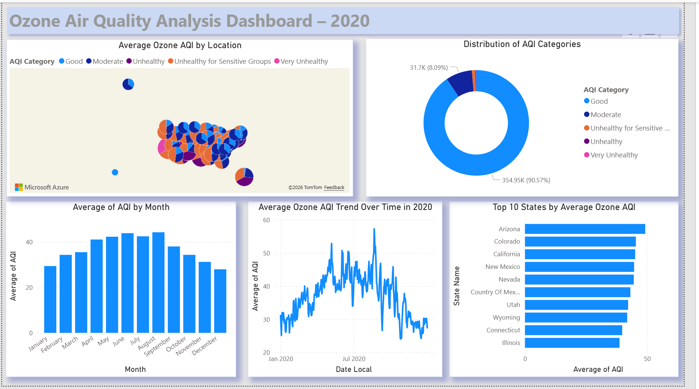

# Ozone Air Quality Analysis Dashboard – 2020

## Project Overview
This project analyzes ozone air quality data for 2020 using Power BI.  
The dashboard provides insights into AQI categories, monthly AQI trends, daily ozone changes, geographic distribution, and top states by average ozone AQI.

## Dashboard Preview

## Key Questions
- What is the distribution of AQI categories?
- How does AQI change across months?
- What is the ozone AQI trend over time in 2020?
- Which states have the highest average ozone AQI?
- How does ozone AQI vary by location?

## Key Insights
- Most AQI records fall under the Good category.
- Ozone AQI increases during warmer months, especially around summer.
- Arizona, Colorado, and California show some of the highest average ozone AQI values.
- The map helps compare ozone air quality across different locations.

## Tools Used
- Power BI
- Power Query
- DAX
- Excel / CSV Dataset

## Files
- `Ozone Air Quality Analysis Dashboard – 2020.pbix`: Power BI dashboard file
- `ozone_dashboard.png`: Dashboard screenshot
- `sample_daily_ozone_2020.xlsx`: Sample dataset used for preview

## Author
Hanin Yousif
